# 5-Stage Pipelined ARM Processor in Verilog HDL
### Hardware Implementation with Dynamic Forwarding, Hazard Detection, and Multi-Cycle SRAM Controller

[](https://en.wikipedia.org/wiki/Verilog)
[](https://www.xilinx.com/products/design-tools/vivado.html)
[-orange.svg)](https://www.xilinx.com/products/silicon-devices/soc/zynq-7000.html)
[]()
[](LICENSE)
[](https://ece.ut.ac.ir/)

A high-performance, synthesizable **32-bit 5-Stage Pipelined RISC Processor** implementing an **ARMv4T-compatible integer instruction set** in Verilog HDL. Designed and verified as part of the **Computer Architecture Laboratory** at the **Department of Electrical and Computer Engineering, University of Tehran**, supervised by **Dr. Saeed Safari**.

The core features full hardware handling of structural, data, and control hazards via a **Dynamic Operand Forwarding Unit** (zero-bubble bypassing from EX/MEM and MEM/WB stages) and a **Load-Use Hazard Detection Unit**. To interface with narrow physical memories, a multi-cycle **SRAM Controller FSM** transparently serializes 32-bit word transactions into 4 sequential 8-bit byte bursts with automated pipeline freezing. Physical implementation on a **Xilinx Zynq-7000 SoC (XC7Z010CLG400-1)** achieves **$F_{\max} = 125.09	ext{ MHz}$** with an ultra-compact footprint of **809 Slice LUTs (4.60%)** and **zero timing violations**.

---

## Table of Contents
- [Architectural Highlights](#architectural-highlights)
- [System Architecture & Datapath](#system-architecture--datapath)
- [Pipeline Stage Details](#pipeline-stage-details)
  - [1. Instruction Fetch (IF)](#1-instruction-fetch-if)
  - [2. Instruction Decode & Register File (ID)](#2-instruction-decode--register-file-id)
  - [3. Execution & Arithmetic Logic Unit (EX)](#3-execution--arithmetic-logic-unit-ex)
  - [4. Memory Access & SRAM Controller (MEM)](#4-memory-access--sram-controller-mem)
  - [5. Write-Back (WB)](#5-write-back-wb)
- [Hazard Resolution & Dynamic Forwarding](#hazard-resolution--dynamic-forwarding)
- [Multi-Cycle SRAM Subsystem](#multi-cycle-sram-subsystem)
- [Empirical Benchmarks & Speedup](#empirical-benchmarks--speedup)
- [FPGA Implementation & Synthesis Results](#fpga-implementation--synthesis-results)
- [Repository Structure](#repository-structure)
- [Verification & Simulation Guide](#verification--simulation-guide)
- [خلاصه معماری به زبان فارسی (Persian Overview)](#خلاصه-معماری-به-زبان-فارسی-persian-overview)
- [Author & License](#author--license)

---

## Architectural Highlights

- **Classic 5-Stage RISC Pipeline**: Instruction Fetch (`IF`), Instruction Decode (`ID`), Execution (`EX`), Memory Access (`MEM`), and Write-Back (`WB`).
- **Dynamic Operand Forwarding**: Resolves Read-After-Write (RAW) data hazards across both EX/MEM and MEM/WB pipeline stages with dynamic priority routing (MEM stage prioritised over WB stage).
- **Load-Use Hazard Detection**: Detects RAW data dependencies following `LDR` instructions, automatically freezing `PC` and `IF/ID` stage registers while inserting a bubble into `ID/EX`.
- **Branch Penalty Minimization**: Branch evaluation in the `EX` stage with a 2-cycle flush mechanism clearing speculatively fetched instructions on branch taken.
- **Architectural Condition Code Evaluator**: Full support for 15 ARM condition codes (`EQ`, `NE`, `CS/HS`, `CC/LO`, `MI`, `PL`, `VS`, `VC`, `HI`, `LS`, `GE`, `LT`, `GT`, `LE`, `AL`) against `NZCV` flags.
- **Flexible Shifter Operand (Barrel Shifter)**: Hardware generator supporting 32-bit rotated immediates ($8	ext{-bit immediate} \ 	ext{ROR} \ 2 	imes 	ext{rotate\_imm}$) and register shifts (`LSL`, `LSR`, `ASR`, `ROR`).
- **Multi-Cycle SRAM Controller**: 3-state Finite State Machine (`IDLE`, `WORK`, `DONE`) managing 4-cycle sequential byte access over an 8-bit bidirectional memory bus with `cpu_ready` handshaking.
- **Banked Register File**: 16 $	imes$ 32-bit registers ($R_0 - R_{15}$) featuring dual asynchronous read ports and negative-edge synchronous writing to prevent write-after-read hazards within the same clock cycle.
- **Hardware Verified**: Board-level wrapper with debounce filtering and Integrated Logic Analyzer (ILA) real-time hardware probing on Xilinx Zynq-7000 FPGA.

---

## System Architecture & Datapath

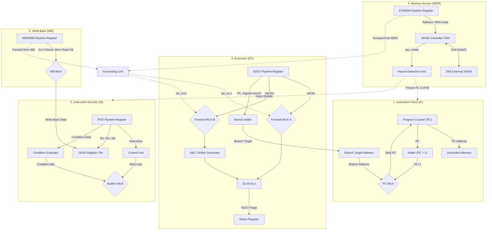

<p align="center">
  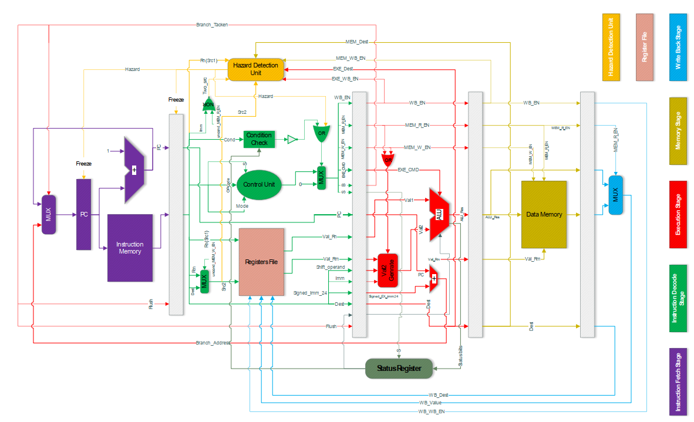<br>
  <em>Figure 1: Complete 5-Stage Pipelined ARM Processor Datapath with Forwarding and Hazard Detection.</em>
</p>

---

## Pipeline Stage Details

### 1. Instruction Fetch (IF)
- **Program Counter (`pc.v`)**: 32-bit synchronous register with asynchronous active-high reset and freeze control.
- **PC Increment Adder (`adder.v`)**: Adds `32'd1` each cycle (word-aligned addressing in local memory model).
- **Branch Multiplexer (`mux2to1.v`)**: Selects between sequential $	ext{PC}+1$ and branch target address computed in the `EX` stage.
- **Pipeline Freeze Support**: Holds the current PC value unconditionally whenever `hazard_detected` or `~sram_ready` is asserted.

<p align="center">
  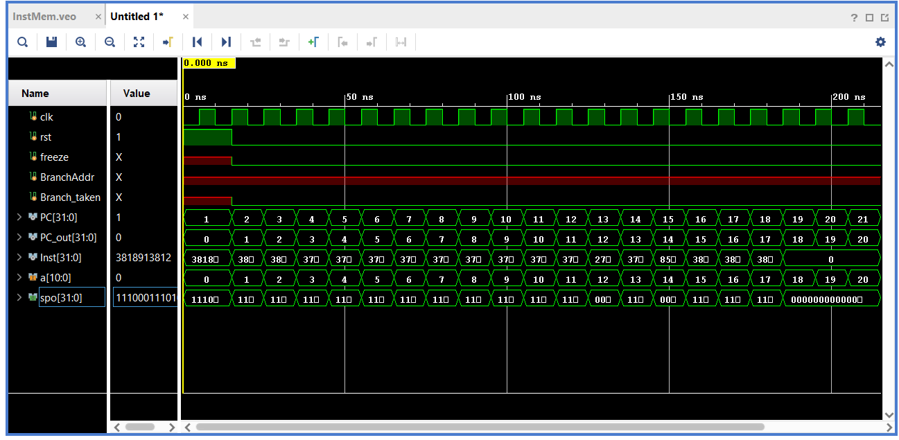<br>
  <em>Figure 2: Cycle-accurate simulation of the IF stage showing sequential PC increments and branch redirection.</em>
</p>

---

### 2. Instruction Decode & Register File (ID)
- **Control Unit (`controller.v`)**: Decodes 4-bit Opcode, 2-bit Mode, and S-bit to emit 9-bit execution and pipeline control words (`wb_en`, `mem_r_en`, `mem_w_en`, `b`, `s_out`, `exe_cmd`).
- **Banked Register File (`register_file.v`)**: $16 	imes 32$-bit register array ($R_0-R_{15}$). Writes occur on `negedge clk` while reads are asynchronous (`assign reg1 = rf[src1]`), eliminating intra-cycle RAW structural races.
- **Condition Evaluator (`condition_check.v`)**: Asserts `cond_met` based on active status flags (`Z`, `C`, `N`, `V`). If the condition fails, the instruction is converted into a pipeline `NOP` via bubble injection.
- **Second Source Selector (`mux2to1_4.v`)**: Selects register index $R_m$ (`Inst[3:0]`) for data-processing operations, or register index $R_d$ (`Inst[15:12]`) for store operations (`STR`), since $R_d$ serves as the data source to be written to memory.

<p align="center">
  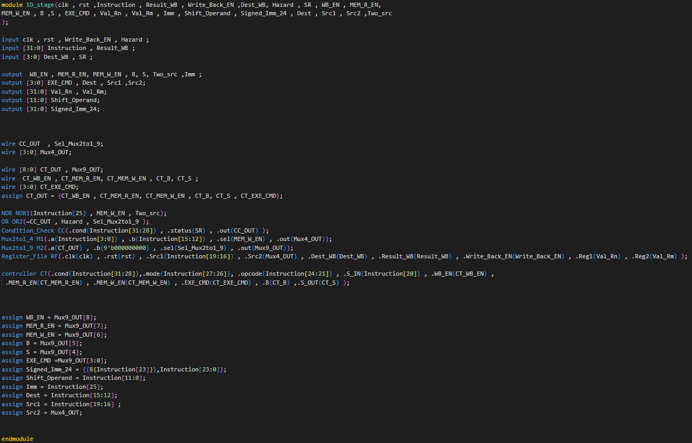<br>
  <em>Figure 3: Instruction Decode simulation displaying operand decoding, RF readouts, and condition evaluation.</em>
</p>

---

### 3. Execution & Arithmetic Logic Unit (EX)
- **32-bit ALU (`alu.v`)**: Supports arithmetic (`ADD`, `ADC`, `SUB`, `SBC`), logical (`AND`, `ORR`, `EOR`, `MOV`, `MVN`), and comparison operations (`CMP`, `TST`). Computes condition flags:
  $$	ext{Zero Flag } (Z) = (	ext{ALU\_Res} == 0)$$
  $$	ext{Negative Flag } (N) = 	ext{ALU\_Res}[31]$$
  $$	ext{Carry Flag } (C) = 	ext{Carry-out of addition/subtraction}$$
  $$	ext{Overflow Flag } (V) = (\sim V_1[31] \land \sim V_2[31] \land R[31]) \lor (V_1[31] \land V_2[31] \land \sim R[31])$$
- **Val2 Generator (`val2_generator.v`)**: Implements flexible shifter operand hardware:
  - Immediate mode ($I=1$): 8-bit immediate rotated right by $2 	imes 	ext{rotate\_imm}$.
  - Memory offset mode: 12-bit immediate zero-extended.
  - Register shift mode ($I=0$): `LSL` (00), `LSR` (01), `ASR` (10, using `$signed`), `ROR` (11).
- **Branch Target Adder (`adder.v`)**: Computes $	ext{Branch Target} = 	ext{PC} + 	ext{SignExtended}(	ext{Imm24})$.

<p align="center">
  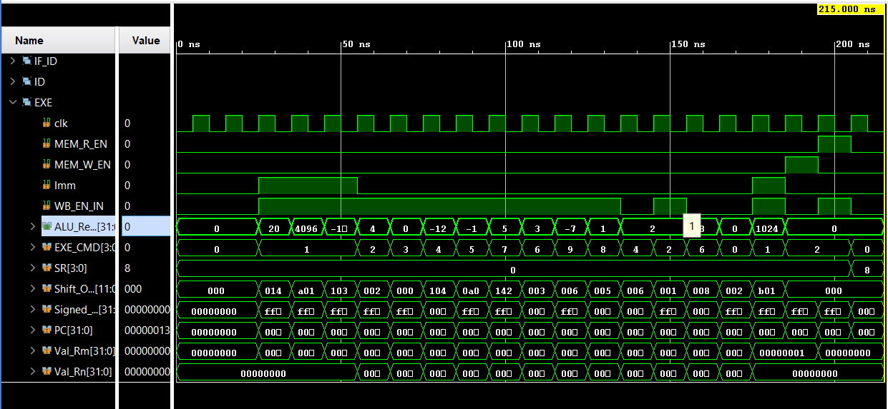<br>
  <em>Figure 4: Execution stage waveform showing 32-bit ALU computations, shifter operand generation, and status flag updates.</em>
</p>

---

### 4. Memory Access & SRAM Controller (MEM)
- **SRAM Controller FSM (`sram_controller.v`)**: Multi-cycle memory interface connecting the 32-bit CPU bus to an external 8-bit byte-addressable SRAM.
- **Pipeline Handshake**: While the 4-byte memory transfer is ongoing, the controller deasserts `cpu_ready`, halting the entire pipeline (`freeze_all_stages = ~cpu_ready`).

<p align="center">
  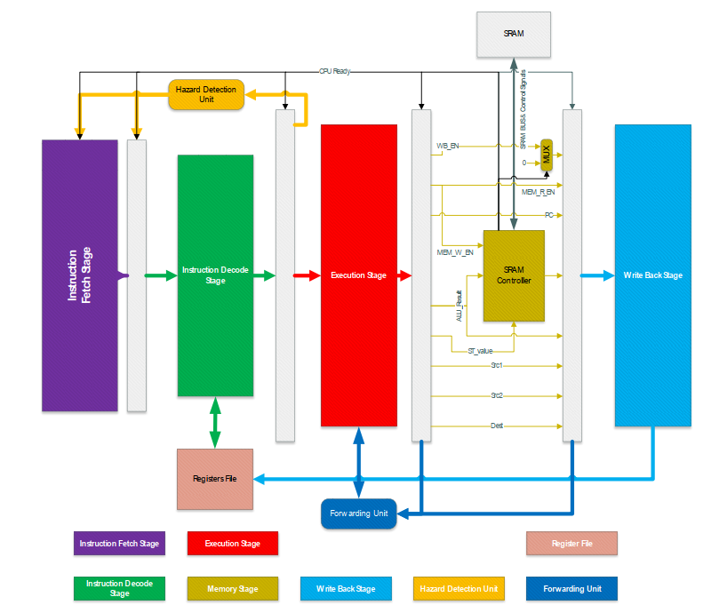<br>
  <em>Figure 5: ARM processor core interfaced with the multi-cycle SRAM Controller and physical 8-bit memory chip.</em>
</p>

---

### 5. Write-Back (WB)
- **Result Multiplexer (`mux2to1.v`)**: Selects between the registered ALU execution result (`alu_result_wb`) and the loaded memory data (`mem_read_val_wb`) guided by `mem_r_en_wb`.
- The selected word is routed back to the Register File write port and simultaneously made available to the Forwarding Unit.

---

## Hazard Resolution & Dynamic Forwarding

### 1. Dynamic Forwarding Unit (`forwarding_unit.v`)
Without operand forwarding, any Read-After-Write (RAW) data dependency requires 2 stall cycles until the result is written back to the Register File. The Dynamic Forwarding Unit monitors stage registers and dynamically routes calculated values directly to ALU inputs:

$$	ext{Forward}_{	ext{src1}} = 
egin{cases}
2	ext{'b01} & 	ext{if } 	ext{wb\_en}_{	ext{MEM}} \land (	ext{dest}_{	ext{MEM}} == 	ext{src1}) \quad 	ext{[Forward from MEM stage]} \
2	ext{'b10} & 	ext{else if } 	ext{wb\_en}_{	ext{WB}} \land (	ext{dest}_{	ext{WB}} == 	ext{src1}) \quad 	ext{[Forward from WB stage]} \
2	ext{'b00} & 	ext{otherwise} \quad 	ext{[Use Register File output]}
\end{cases}$$

$$	ext{Forward}_{	ext{src2}} = 
egin{cases}
2	ext{'b01} & 	ext{if } 	ext{wb\_en}_{	ext{MEM}} \land (	ext{dest}_{	ext{MEM}} == 	ext{src2}) \quad 	ext{[Forward from MEM stage]} \
2	ext{'b10} & 	ext{else if } 	ext{wb\_en}_{	ext{WB}} \land (	ext{dest}_{	ext{WB}} == 	ext{src2}) \quad 	ext{[Forward from WB stage]} \
2	ext{'b00} & 	ext{otherwise} \quad 	ext{[Use Register File output]}
\end{cases}$$

### 2. Load-Use Hazard Detection Unit (`hazard_unit.v`)
Because memory read data is only available at the conclusion of the `MEM` stage, an instruction immediately following an `LDR` that consumes the loaded register cannot be satisfied by forwarding alone. In this case:
1. The Hazard Detection Unit asserts `hazard_detected = 1'b1`.
2. `PC` and `IF/ID` registers are frozen for 1 cycle.
3. A `NOP` bubble is inserted into the `ID/EX` stage.
4. On the subsequent cycle, the loaded value is forwarded from `MEM` stage to `EX` stage with zero additional penalty.

<p align="center">
  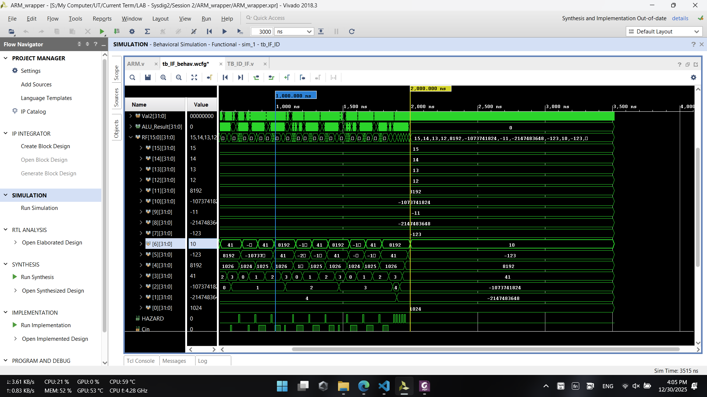<br>
  <em>Figure 6: Waveform comparison verifying zero-stall dynamic operand bypassing from MEM and WB stages into the ALU.</em>
</p>

---

## Multi-Cycle SRAM Subsystem

The SRAM memory controller serializes 32-bit word accesses across an 8-bit external bus utilizing a 3-state Finite State Machine:

<p align="center">
  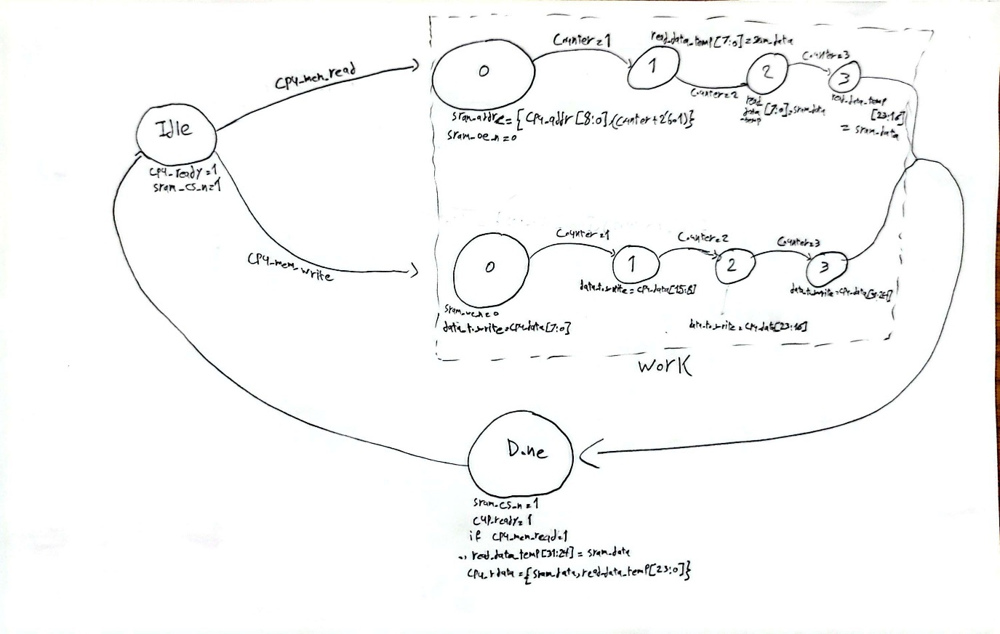<br>
  <em>Figure 7: Finite State Machine transition diagram for the multi-cycle SRAM controller.</em>
</p>

1. **`IDLE` (State `2'd0`)**: `cpu_ready = 1`. When `cpu_mem_read` or `cpu_mem_write` is asserted, transitions to `WORK` and deasserts `cpu_ready = 0`.
2. **`WORK` (State `2'd1`)**: Steps a 2-bit counter from `0` to `3`:
   - **Store (`STR`)**: Asserts `sram_we_n = 0`, sequentially placing `cpu_wdata[7:0]`, `[15:8]`, `[23:16]`, and `[31:24]` on `sram_data` while incrementing `sram_addr`.
   - **Load (`LDR`)**: Asserts `sram_oe_n = 0`, reading 4 consecutive bytes from `sram_data` into internal latch registers.
   - When `counter == 3`, transitions to `DONE`.
3. **`DONE` (State `2'd2`)**: Re-asserts `cpu_ready = 1`, presents the assembled 32-bit word `cpu_rdata = {sram_data, read_data_temp[23:0]}` to the processor datapath, and transitions back to `IDLE`.

---

## Empirical Benchmarks & Speedup

The processor was rigorously benchmarked using a standard 47-instruction verification program testing arithmetic operations, load-use hazards, branch loops, and multi-cycle memory transfers:

| Architectural Configuration | Clock Cycles ($T_{	ext{clk}}=10	ext{ ns}$) | Total Execution Time | Average CPI | Speedup from Forwarding |
| :--- | :---: | :---: | :---: | :---: |
| **Ideal Memory (No Forwarding)** | 292 | 2,920 ns | 6.213 | — |
| **Ideal Memory (With Forwarding)** | **200** | **2,000 ns** | **4.255** | **+31.51%** |
| **Multi-Cycle SRAM (No Forwarding)** | 529 | 5,290 ns | 11.255 | — |
| **Multi-Cycle SRAM (With Forwarding)** | **437** | **4,370 ns** | **9.298** | **+17.39%** |

$$	ext{Speedup}_{	ext{ideal}} = rac{6.213 - 4.255}{6.213} 	imes 100\% = \mathbf{31.51\%}$$

$$	ext{Speedup}_{	ext{SRAM}} = rac{11.255 - 9.298}{11.255} 	imes 100\% = \mathbf{17.39\%}$$

<p align="center">
  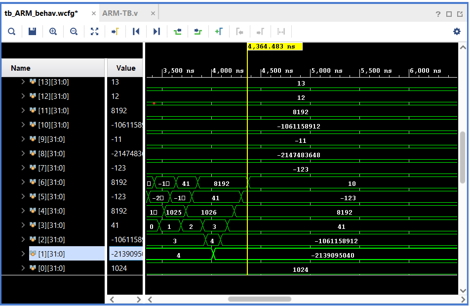
  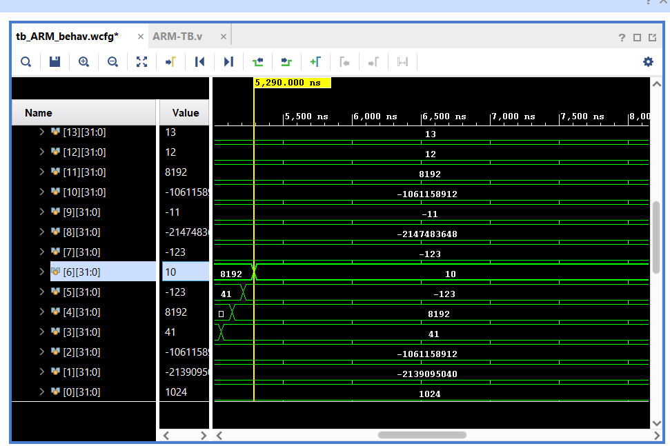<br>
  <em>Figure 8: Comparative simulation waveforms with SRAM: (Left) Forwarding Enabled (437 cycles); (Right) Forwarding Disabled (529 cycles).</em>
</p>

---

## FPGA Implementation & Synthesis Results

The processor was synthesized and placed-and-routed using **Xilinx Vivado 2018.3** targeting the **Xilinx Zynq-7000 SoC (`xc7z010clg400-1`)**.

### Hardware Utilization Summary

| Site Type | Used | Available | Utilization (%) |
| :--- | :---: | :---: | :---: |
| **Slice LUTs** | **809** | **17,600** | **4.60%** |
| ├── *LUT as Logic* | 679 | 17,600 | 3.86% |
| └── *LUT as Shift Register* | 130 | 6,000 | 2.17% |
| **Slice Registers (FF)** | **1,365** | **35,200** | **3.88%** |
| **Block RAM Tile** | **1.5** | **60** | **2.50%** |
| ├── *RAMB36E1* | 1 | 60 | 1.67% |
| └── *RAMB18E1* | 1 | 120 | 0.83% |
| **F7 Multiplexers** | **3** | **8,800** | **0.03%** |
| **Global Clock Buffers (BUFG)** | **1** | **32** | **3.13%** |

<p align="center">
  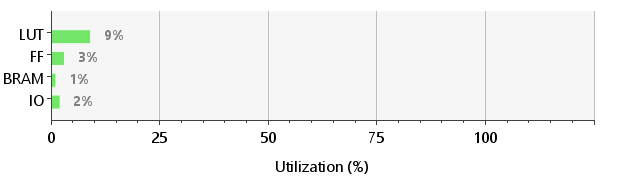<br>
  <em>Figure 9: Post-implementation hardware utilization on Xilinx Zynq-7000 FPGA.</em>
</p>

### Timing & Frequency Analysis
- **Target Constraint Clock**: $50.00	ext{ MHz}$ ($T_{	ext{clk}} = 20.000	ext{ ns}$)
- **Worst Negative Slack (WNS)**: $\mathbf{+12.006	ext{ ns}}$ (Zero timing violations)
- **Worst Hold Slack (WHS)**: $+0.023	ext{ ns}$
- **Worst Pulse Width Slack (WPWS)**: $+8.750	ext{ ns}$
- **Minimum Allowable Clock Period**:
  $$T_{\min} = T_{	ext{req}} - 	ext{WNS} = 20.000	ext{ ns} - 12.006	ext{ ns} = \mathbf{7.994	ext{ ns}}$$
- **Maximum Operating Frequency ($F_{\max}$)**:
  $$F_{\max} = rac{1}{T_{\min}} = rac{1}{7.994	ext{ ns}} pprox \mathbf{125.09	ext{ MHz}}$$

<p align="center">
  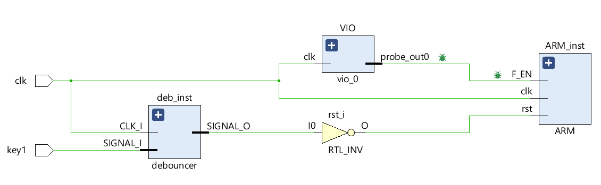
  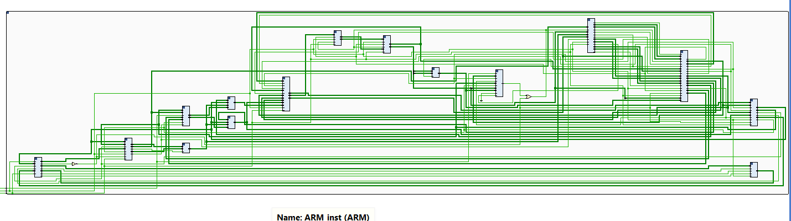<br>
  <em>Figure 10: (Left) Device floorplan mapping on Zynq-7000; (Right) Synthesized gate-level netlist schematic.</em>
</p>

---

## Repository Structure

```text
Pipelined-ARM-Processor-Verilog/
├── rtl/                         # Synthesizable Verilog HDL source files
│   ├── adder.v                  # 32-bit ripple/carry adder for PC & branch target
│   ├── alu.v                    # 32-bit ALU supporting ARM arithmetic, logic, and CMP
│   ├── arm_core.v               # Top-level ARM 5-stage pipelined processor core
│   ├── arm_wrapper.v            # Board-level wrapper for FPGA synthesis with debouncer
│   ├── condition_check.v        # Evaluator for 15 ARM condition codes against NZCV
│   ├── controller.v             # Main instruction opcode and mode decoder
│   ├── debouncer.v              # Digital pushbutton debouncer for board clock/reset
│   ├── ex_mem_reg.v             # EX/MEM stage pipeline register
│   ├── ex_stage.v               # Execution stage (ALU, Val2 generator, status register)
│   ├── forwarding_unit.v        # Dynamic operand forwarding bypass unit (MEM & WB to EX)
│   ├── hazard_unit.v            # RAW Load-Use hazard detection and pipeline freeze unit
│   ├── id_ex_reg.v              # ID/EX stage pipeline register with flush/bubble support
│   ├── id_stage.v               # Instruction Decode stage (RF, controller, condition check)
│   ├── if_id_reg.v              # IF/ID stage pipeline register with freeze/flush
│   ├── if_stage.v               # Instruction Fetch stage (PC register, PC+1 adder, branch mux)
│   ├── mem_stage.v              # Memory stage interface
│   ├── mem_wb_reg.v             # MEM/WB stage pipeline register
│   ├── mux2to1.v                # Parameterized 2-to-1 multiplexer
│   ├── mux2to1_4.v              # 4-bit 2-to-1 multiplexer for register addresses
│   ├── mux2to1_9.v              # 9-bit 2-to-1 multiplexer for control bubble injection
│   ├── mux3to1_32.v             # 32-bit 3-to-1 multiplexer for operand forwarding
│   ├── pc.v                     # 32-bit Program Counter register with freeze enable
│   ├── register_file.v          # 16x32-bit banked register file with negedge synchronous write
│   ├── sram_controller.v        # 3-state FSM multi-cycle SRAM memory controller
│   ├── sram_model.v             # Behavioral 2KB byte-addressable SRAM chip model
│   ├── status_register.v        # 4-bit architectural condition flag register (NZCV)
│   ├── val2_generator.v         # Shifter operand & 32-bit rotated immediate generator
│   └── wb_stage.v               # Write-back multiplexer stage
├── tb/                          # Verification testbench suites
│   ├── instruction_memory.v     # Behavioral ROM preloaded with test machine code
│   ├── tb_arm.v                 # Top-level self-checking processor testbench with CPI counters
│   ├── tb_controller.v          # Standalone control unit verification testbench
│   ├── tb_sram.v                # Standalone SRAM controller multi-cycle verification testbench
│   └── program.hex              # Benchmark machine code program in Verilog memory format
├── sim/                         # Simulation automation scripts and waveforms
│   ├── program.coe              # Xilinx coefficient file for Block RAM initialization
│   ├── program.hex              # Machine code instructions for simulation
│   ├── run_modelsim.tcl         # Automated compilation and execution script for ModelSim/Questa
│   ├── run_vivado.tcl           # Batch-mode simulation script for Vivado XSim
│   └── waveform.wcfg            # Vivado waveform signal display configuration
├── docs/                        # Architectural documentation and reports
│   ├── figures/                 # 34 high-resolution schematics, waveforms, and FPGA charts
│   ├── IEEE_Report.tex          # Academic paper in IEEEtran conference format
│   └── CA_Lab_Report_Persian.pdf# Archival laboratory technical report (Persian)
├── .gitignore                   # Vivado and ModelSim build artifact exclusions
├── LICENSE                      # MIT Open-Source License
└── README.md                    # Bilingual comprehensive documentation
```

---

## Verification & Simulation Guide

### Prerequisites
- **ModelSim / QuestaSim** (v10.4+) OR **Xilinx Vivado** (2018.3 or newer).

### 1. Running ModelSim / QuestaSim
Open ModelSim, navigate to the `sim/` directory, and execute:
```tcl
cd sim
do run_modelsim.tcl
```
The testbench will automatically compile all RTL and TB sources, load `sim/program.hex`, run for 6,000 ns, display all datapath signals in the waveform viewer, and print the cycle performance report to the console.

### 2. Running Xilinx Vivado Simulation (Batch Mode)
From a terminal or PowerShell in the `sim/` directory:
```bash
cd sim
vivado -mode batch -source run_vivado.tcl
```

### 3. Toggling Forwarding vs. Stalling Comparison
In `tb/tb_arm.v`, adjust line 62:
```verilog
forwarding_en = 1; // 1 = Dynamic Forwarding Enabled (200 cycles / 437 cycles)
                   // 0 = Stalling Only (292 cycles / 529 cycles)
```

---

## خلاصه معماری به زبان فارسی (Persian Overview)

<div dir="rtl" align="right">

### پیاده‌سازی سخت‌افزاری پردازنده ۵ طبقه‌ای خط‌لوله‌ای ARM در زبان Verilog HDL

این مخزن شامل طراحی کامل، اعتبارسنجی چرخه‌دقیق و پیاده‌سازی فیزیکی یک پردازنده ۳۲ بیتی با معماری خط‌لوله‌ای (۵ طبقه‌ای) سازگار با مجموعه دستورات **ARMv4T** می‌باشد که در آزمایشگاه معماری کامپیوتر دانشکده مهندسی برق و کامپیوتر **دانشگاه تهران** تحت نظارت **دکتر سعید صفری** پیاده‌سازی شده است.

#### ویژگی‌های برجسته فنی:
۱. **پایپ‌لاین ۵ طبقه‌ای استاندارد RISC**: شامل طبقات واکشی دستور (`IF`)، دیکود و خواندن از رجیستر فایل (`ID`)، اجرا و محاسبات آریتمتیک (`EX`)، دسترسی به حافظه (`MEM`)، و بازنویسی در رجیستر فایل (`WB`).
۲. **واحد فورواردینگ پویا (Forwarding Unit)**: حذف کامل حباب‌های خط‌لوله ناشی از مخاطرات داده‌ای RAW با ارسال مستقیم نتایج از خروجی مراحل EX/MEM و MEM/WB به ورودی‌های ALU با اولویت‌بندی داینامیک.
۳. **واحد تشخیص و مدیریت مخاطره (Hazard Detection Unit)**: تشخیص هوشمند مخاطره Load-Use (وابستگی داده‌ای به دستور LDR) و توقف خط‌لوله (Freeze) به مدت ۱ سیکل به همراه تزریق حباب NOP.
۴. **کنترلر حافظه خارجی چندسیکلی SRAM**: طراحی ماشین حالت متناهی (FSM) سه‌وضعیته به منظور تبدیل دسترسی‌های کلمه‌ای ۳۲ بیتی به ۴ بایت متوالی بر روی باس داده ۸ بیتی حافظه فیزیکی به همراه پروتکل Handshake و فریز خودکار پردازنده.
۵. **رجیستر فایل بانک‌شده ۱۶ در ۳۲ بیتی**: خواندن غیرهمگام با دو پورت مستقل و نوشتن در لبه پایین‌رونده کلاک (`negedge`) جهت جلوگیری از مخاطرات ساختاری و تداخل همزمان خواندن و نوشتن.
۶. **پشتیبانی کامل از شروط دستوری ARM**: ارزیابی بلادرنگ ۱۵ کد شرطی ARM با توجه به ۴ بیت پرچم وضعیت (`Z, C, N, V`).

#### نتایج ارزیابی و بنچ‌مارک شبیه‌سازی (۴۷ دستورالعمل):
- **حافظه ایده‌آل تک‌سیکلی بدون فورواردینگ**: ۲۹۲ سیکل ($	ext{CPI} = 6.213$)
- **حافظه ایده‌آل تک‌سیکلی با فورواردینگ**: ۲۰۰ سیکل ($	ext{CPI} = 4.255$) $\leftarrow$ **۳۱.۵۱٪ بهبود سرعت (Speedup)**
- **حافظه چندسیکلی SRAM بدون فورواردینگ**: ۵۲۹ سیکل ($	ext{CPI} = 11.255$)
- **حافظه چندسیکلی SRAM با فورواردینگ**: ۴۳۷ سیکل ($	ext{CPI} = 9.298$) $\leftarrow$ **۱۷.۳۹٪ بهبود سرعت (Speedup)**

#### نتایج سنتز سخت‌افزاری روی تراشه FPGA (Xilinx Zynq-7000):
- **تعداد Slice LUTs مصرفی**: ۸۰۹ از ۱۷,۶۰۰ (فقط ۴.۶۰٪ کل تراشه)
- **تعداد Slice Registers (FFs)**: ۱,۳۶۵ از ۳۵,۲۰۰ (فقط ۳.۸۸٪)
- **حافظه Block RAM مصرفی**: ۱.۵ تایل (۲.۵۰٪)
- **بیشینه فرکانس کاری ($F_{\max}$)**: **۱۲۵.۰۹ مگاهرتز** ($T_{\min} = 7.994	ext{ ns}$ با حاشیه مثبت $	ext{WNS} = +12.006	ext{ ns}$ بدون کمترین نقض زمانی).

</div>

---

## Author & License

- **Author**: [Alireza Najafi Motiei](https://github.com/alirezanmotiei)
- **Affiliation**: Department of Electrical and Computer Engineering, University of Tehran
- **Course**: Computer Architecture Laboratory
- **Supervisor**: Dr. Saeed Safari
- **License**: Distributed under the terms of the [MIT License](LICENSE).
